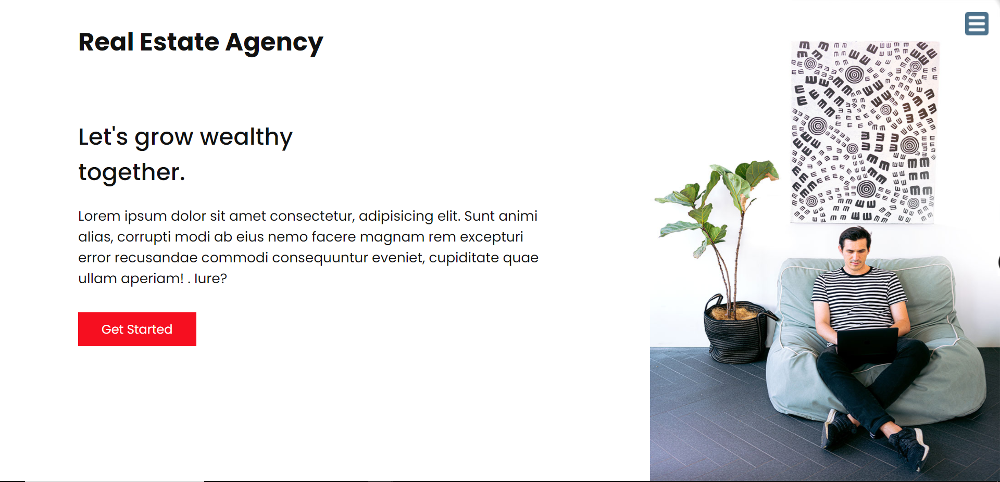

# Real Estate Agency Website README file
About:
A simple real estate agency website using html and css.

Purpose:
This website was made to just put my html and css skills into practise.

Contents:
Real Estate Agency Website is a 4 page website with the services,work and contact details .
Learnt various concepts like css grid and flexbox.
I have linked my social media profiles in the website ,if you are intrested to checkout!

Make sure you use the toggle button at the right top corner to visit pages.

<a href="https://onewayshruti.github.io/real_estate_agency_website/" target="_blank">LIVE PREVIEW</a>

Giving credits:
Thankyou Brad Traversy for such great guides and videos.
Go checkout his youtube channel:<a href="https://www.youtube.com/user/TechGuyWeb">Brad Traversy</a>

Lets connect!:

<a href ="www.linkedin.com/in/onewayshruti">Linkedin</a> 

<a href = "https://github.com/OnewayShruti">Github</a> 

<a href="https://twitter.com/OnewayShruti">Twitter</a> 

